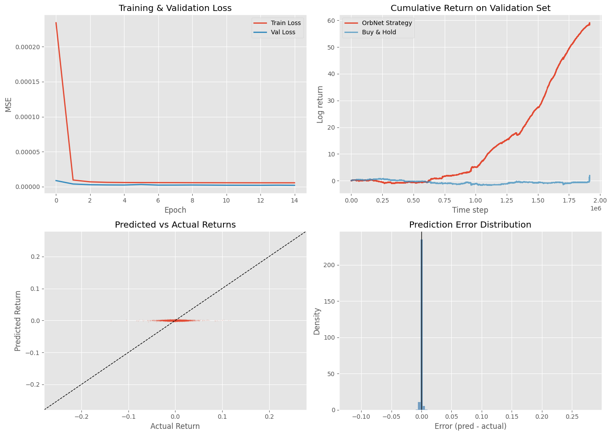

# Result Evaluation

---

| Metric | Evaluation |
|---|---|
| **Training Convergence** | Rapid loss reduction in the first few epochs, followed by stable convergence. |
| **Validation Stability** | Validation loss decreases alongside training loss and remains relatively stable after convergence. |
| **Generalization** | No obvious late-stage train/validation divergence is visible in this run. |
| **Strategy Performance** | OrbNet's cumulative validation log-return increases substantially during the latter part of the evaluation period. |
| **Baseline Comparison** | OrbNet separates considerably from the Buy & Hold reference over the validation period. |
| **Prediction Distribution** | Predicted returns are concentrated close to zero, indicating relatively small output magnitudes. |
| **Prediction Error** | Errors are strongly concentrated around zero, with a comparatively small number of larger deviations. |
| **Signal Behavior** | The strategy appears to extract repeated small signals rather than relying on large individual predictions. |
| **Current Assessment** | The experiment shows a meaningful validation signal, but robustness has not yet been established. |
| **Next Validation Step** | Test across unseen periods, multiple assets, transaction costs, slippage, turnover, and drawdown. |

---

## Key observation:

- Training loss decreases from roughly `2.3 × 10⁻⁴` to the low `10⁻⁶` range.
- Validation loss also falls rapidly and remains relatively stable afterward.
- The train/validation curves do not show a large late-stage divergence in this run.

---

### Summary

The current experiment shows **fast convergence, stable validation behavior, and strong separation from the Buy & Hold baseline on the validation set**. The prediction outputs themselves remain small and tightly distributed around zero, suggesting that the observed strategy performance is accumulated from many small signals rather than extreme predictions.

